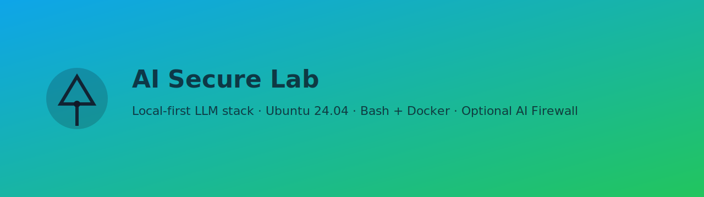

<!-- Social / Banner -->
<p align="center">
  
</p>

<p align="center">
  [](#) [](#) [](#) [](#) [](LICENSE) [](#)
</p>

<h1 align="center">AI Secure Lab</h1>
<p align="center"><i>Local‑first LLM stack for Ubuntu 24.04 using Bash + Docker, with an optional AI Firewall.</i></p>

---

## ✨ Highlights
- **Ubuntu 24.04–compatible** from a fresh host (no deprecated apt-key, codename-safe repos)
- **Bash-first** operations with clear comments and idempotent scripts
- **OpenWebUI + Ollama** for a smooth local LLM UX (CPU‑only fallback supported)
- **AI Firewall (optional)** to inspect prompts & outputs with YAML rules (enforce/monitor)
- **Traefik** entry with basic auth + clean routing
- **Docs & examples** designed for teaching, demos, and repeatable deployments

## 🚀 Quickstart
```bash
git clone https://github.com/your-org/ai-secure-lab.git
cd ai-secure-lab
cp .env.example .env   # set passwords/ports/mode

sudo bash scripts/bootstrap_host.sh           # Docker CE + compose + tools
sudo bash scripts/install_nvidia_container_toolkit.sh  # optional GPU offload
bash scripts/start_stack.sh

# Pull smaller models first for older GPUs
bash scripts/pull_models_ollama.sh
```

**UIs**
- Traefik: `http://localhost:$TRAEFIK_HTTP_PORT` (dashboard protected by basic auth)
- OpenWebUI: `http://localhost:$OPENWEBUI_PORT`
- Firewall health: `http://localhost:$FIREWALL_PORT/health`

## 🧱 Stack
```
[Client] -> [Traefik] -> [AI-Firewall enforce/monitor] -> [OpenWebUI] -> [Ollama]
```

## 🛡️ AI Firewall
- Configure regex rules in `firewall/rules/*.yml`
- Modes: `enforce` (block) or `monitor` (allow + log)
- Example PII/secret/“jailbreak” patterns included

**Curl example**
```bash
curl -s -X POST "http://localhost:${FIREWALL_PORT:-8081}/v1/chat" \
  -H "Content-Type: application/json" \
  -d '{"prompt":"My SSN is 123-45-6789"}'
# -> 400 {"detail":"Policy violation: pii.ssn"}
```

## 🧪 Use‑cases
- **Internal Q&A** on policy docs with zero data egress
- **PII & secret** filtering at ingress/egress
- **CPU‑only** demos for low‑VRAM systems (`OLLAMA_NUM_GPU=0`)
- **Team training**: extend rules, add models, write tests

## 📚 Documentation
- `docs/ARCHITECTURE.md` — components, ports, data flow
- `docs/PLAYBOOK.md` — step‑by‑step deploy & ops
- `docs/USE_CASES.md` — hands‑on examples
- `docs/TROUBLESHOOTING.md` — Ubuntu 24.04 quirks & fixes
- `docs/FAQ.md` — quick answers & model tips

## 🛠️ Scripts (Bash)
```bash
bash scripts/start_stack.sh     # up --build
bash scripts/status.sh          # compose ps
bash scripts/logs.sh            # tail service logs
bash scripts/stop_stack.sh      # down
bash scripts/pull_models_ollama.sh
bash scripts/backup.sh          # tar volumes/
bash scripts/tips_and_checks.sh # env checks & ports
```

## 🔒 Defaults
- No external exposure by default
- Traefik dashboard protected with basic auth
- OpenWebUI authentication enabled
- Firewall defaults to `enforce`

## 🧩 Badges you can customize
- Replace `your-org` with your GitHub org/user to show build badges once CI is added
- Add custom badges for “GPU‑ready”, “CPU‑only mode”, etc.

## 🤝 Contributing
PRs welcome. Please avoid adding secrets/PII. See `SECURITY.md`.

## 📜 License
MIT — see `LICENSE`.
